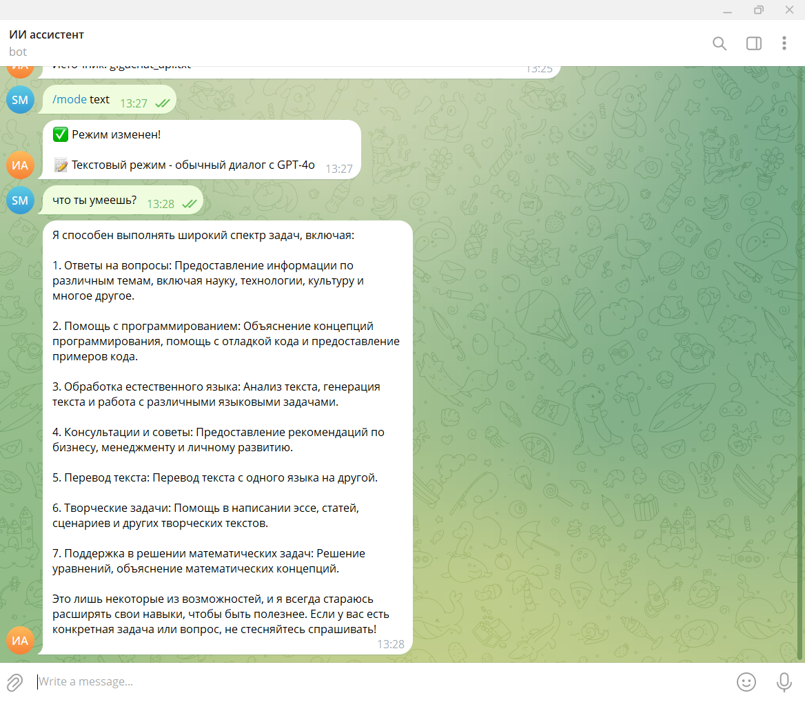
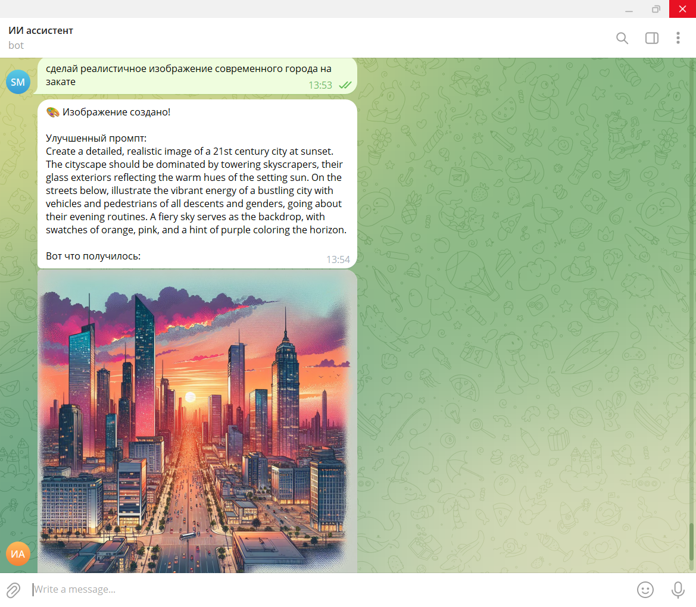

# 🚀 Personal Assistant Bot

## Что это

Личный ассистент в Telegram — мультимодальный бот с GPT-4o, голосом, изображениями и базой знаний.

---

## Что умеет бот

| Возможность | Описание |
|-------------|----------|
| 🔤 **Текст** | Диалог с GPT-4o, ответы на вопросы, помощь с кодом |
| 🎤 **Голос** | Распознавание речи (Whisper) + ответ голосом (TTS) |
| 📸 **Анализ фото** | Описание изображений, извлечение текста, ответы на вопросы по картинке |
| 🎨 **Генерация изображений** | Создание картинок по описанию (DALL-E 3) |
| 📚 **База знаний** | Ответы на основе ваших документов (PDF, TXT, MD) |

### Скриншоты

| Текст | Генерация изображений |
|-------|------------------------|
|  |  |

---

## Что нужно пользователю

- **Python 3.10+**
- **Telegram** — аккаунт и бот (через [@BotFather](https://t.me/BotFather))
- **OpenAI API** — ключ с [platform.openai.com](https://platform.openai.com)
- **FFmpeg** — для голосовых сообщений
- **Из России?** — [ProxyAPI](https://proxyapi.ru) для доступа к OpenAI

---

## Как пользоваться

### Команды

```
/start     - Начать
/help      - Справка
/subscribe - Подписка на изображения (если включена)
/mode      - Режим: text, voice, vision, rag
/voice     - Выбор голоса
/reset     - Очистить историю
/stats     - Статистика базы знаний
/image     - Генерация изображения
```

### Примеры

**Текст:** «Объясни квантовую физику простыми словами»

**Голос:** Запишите голосовое — получите текст + голосовой ответ

**Фото:** Отправьте фото с подписью «Что это?» — получите анализ

**Изображение:** «Нарисуй кота в космосе» или `/image закат на море`

**База знаний:** Загрузите документы в `data/documents/`, переключитесь `/mode rag`, задавайте вопросы

---

## Быстрый старт (5 минут)

1. **Ключи:** [@BotFather](https://t.me/BotFather) → токен бота. [OpenAI](https://platform.openai.com/api-keys) → API ключ.

2. **Установка:**
   ```bash
   python -m venv venv
   venv\Scripts\activate   # Windows
   # source venv/bin/activate  # Linux/Mac
   pip install -r requirements.txt
   ```

3. **FFmpeg:** [Скачать](https://ffmpeg.org/download.html) (Windows) или `sudo apt install ffmpeg` (Linux)

4. **Настройка:** Скопируйте `.env.example` в `.env`, укажите `TELEGRAM_BOT_TOKEN` и `OPENAI_API_KEY`

5. **Запуск:** `python main.py`

6. Найдите бота в Telegram → `/start` → общайтесь!

---

# ⚙️ Настройка и техническая документация

## 📑 Содержание

1. [Установка](#-установка)
2. [Настройка .env](#-настройка-env)
3. [RAG (База знаний)](#-rag-база-знаний)
4. [Генерация изображений](#-генерация-изображений)
5. [Платная подписка](#-платная-подписка-на-изображения)
6. [ProxyAPI (для России)](#-proxyapi-настройка-для-работы-в-россии)
7. [Архитектура](#-архитектура)
8. [Устранение проблем](#-устранение-проблем)

---

## 📦 Установка

### Windows
```bash
python -m venv venv
venv\Scripts\activate
pip install -r requirements.txt
# FFmpeg: https://ffmpeg.org/download.html → добавьте в PATH
```

### Linux/Mac
```bash
python3 -m venv venv
source venv/bin/activate
pip install -r requirements.txt
# Linux: sudo apt-get install ffmpeg
# Mac: brew install ffmpeg
```

---

## 🔧 Настройка .env

Скопируйте `.env.example` в `.env`:

```bash
cp .env.example .env
```

Минимальная конфигурация:

```env
TELEGRAM_BOT_TOKEN=ваш_токен_от_BotFather
OPENAI_API_KEY=sk-proj-xxxxxxxx
BOT_MODE=text
DEFAULT_VOICE=alloy
LOG_LEVEL=INFO
```

Полный список параметров — в `.env.example`.

---

## 📚 RAG (База знаний)

Бот отвечает на вопросы по вашим документам (PDF, TXT, MD).

### Загрузка документов

**Способ 1:** Скопируйте файлы в `data/documents/` и перезапустите бота.

**Способ 2:** Отправьте документ боту в Telegram (до 20 MB).

### Использование

```
/mode rag
Найди информацию о бюджете проекта
```

### Как работает

Документы разбиваются на фрагменты → создаются embeddings (OpenAI) → сохраняются в ChromaDB. При вопросе бот ищет релевантные фрагменты и формирует ответ с контекстом.

---

## 🎨 Генерация изображений

Напишите «Нарисуй кота в космосе» или `/image описание` — бот создаст изображение через DALL-E 3.

**Ключевые слова:** нарисуй, создай изображение, сгенерируй картинку, визуализируй.

**Стоимость:** ~$0.04 за Standard, ~$0.08 за HD (проверьте баланс на platform.openai.com).

---

## 💳 Платная подписка на изображения

Генерация и анализ изображений могут быть платными (оплата через ЮKassa в Telegram).

### Подключение

1. @BotFather → Payments → **Connect ЮKassa: тест** (или платежи)
2. Авторизуйтесь в боте ЮKassa
3. Скопируйте токен из BotFather → BotSettings → Payments

### Настройка .env

```env
SUBSCRIPTION_ENABLED=true
SUBSCRIPTION_PRICE=99
SUBSCRIPTION_ANALYSIS_QUOTA=10
SUBSCRIPTION_GENERATION_QUOTA=5
SUBSCRIPTION_TEST_MODE=true
YOOKASSA_PROVIDER_TOKEN=токен_из_BotFather
```

**SUBSCRIPTION_TEST_MODE=true** — тестовый режим, бот подсказывает тестовые карты. **false** — реальные платежи.

### Тестовые карты (при SUBSCRIPTION_TEST_MODE=true)

| Карта | Платёжная система |
|-------|-------------------|
| 5555 5555 5555 4444 | Mastercard |
| 4111 1111 1111 1111 | Visa |
| 2202 4743 0132 2987 | Mir |

Срок: любой будущий. CVC: любые 3 цифры. [Полный список](https://yookassa.ru/developers/payment-acceptance/testing-and-going-live/testing#test-bank-card)

---

## 🌍 ProxyAPI - Настройка для работы в России

[ProxyAPI](https://proxyapi.ru) — доступ к OpenAI из России без VPN. Оплата в рублях.

```env
USE_PROXYAPI_FOR_IMAGES=true
PROXYAPI_API_KEY=ваш_ключ_proxyapi
```

---

## 🏗️ Архитектура

```
├── main.py, bot.py, config.py
├── handlers/     # start, text, voice, image, document_upload, subscription
├── services/     # openai_client, router, stt, tts, vision, image_generation, subscription, payment
├── rag/          # index, loader, query (ChromaDB)
├── utils/
├── data/documents/   # Документы для RAG
└── .env
```

---

## 🔧 Устранение проблем

**Бот не запускается** — проверьте `.env`, токены.

**Голос не работает** — установите FFmpeg: `ffmpeg -version`

**RAG пусто** — добавьте документы в `data/documents/`, перезапустите. Проверка: `/stats`

**Генерация изображений** — проверьте баланс OpenAI или ProxyAPI.

**Quota exceeded** — пополните баланс на platform.openai.com или proxyapi.ru.

---

## 🧪 Тестирование

```bash
pytest
pytest -v
python test_bot.py
```

---

# 📝 Лицензия

MIT License

---

**Приятного использования! 🚀**
